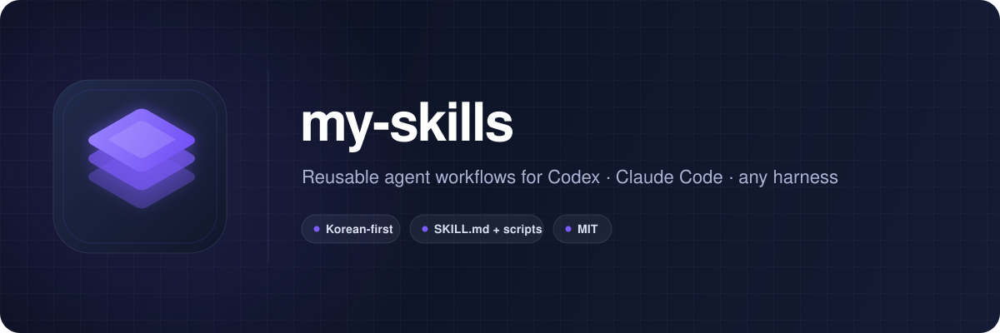

<p align="center">
  
</p>

<p align="center">
  <a href="#빠른-설치"></a>
  
  
  
  
  <a href="LICENSE"></a>
</p>

<p align="center">
  반복해서 쓰는 AI 에이전트 워크플로우를 <b>끝까지 실행 가능한 스킬</b>로 정리한 저장소입니다.<br>
  프롬프트 모음이 아니라, 절차 · 완료 조건 · 금지 사항 · 참고 문서 · 검증 스크립트가 한 폴더에 들어 있습니다.
</p>

---

## 목차

- [빠른 설치](#빠른-설치)
- [스킬 카탈로그](#스킬-카탈로그)
  - [사용자 테스트 피드백 보고서](#-사용자-테스트-피드백-보고서)
  - [모바일 앱 제작 · 출시](#-모바일-앱-제작--출시)
  - [리서치 · 유틸리티](#-리서치--유틸리티)
- [스킬 구조](#스킬-구조)
- [다른 에이전트에서 쓰기](#다른-에이전트에서-쓰기)
- [저장소 검증](#저장소-검증)
- [기여와 라이선스](#기여와-라이선스)

## 빠른 설치

```bash
git clone https://github.com/inhodev/my-skills.git
cd my-skills
./scripts/install.sh all
```

| 명령 | 하는 일 |
|---|---|
| `./scripts/install.sh list` | 설치 가능한 스킬과 묶음 보기 |
| `./scripts/install.sh --dry-run all` | 실제 변경 없이 설치 대상 확인 |
| `./scripts/install.sh all` | 모든 스킬 설치 또는 업데이트 |
| `./scripts/install.sh <skill-name>` | 스킬 하나만 설치 |
| `./scripts/install.sh mobile-app-studio` | 모바일 앱 묶음(7종) 설치 |

- 기본 설치 위치는 `~/.codex/skills`. `CODEX_HOME`이 있으면 `$CODEX_HOME/skills`.
- 같은 이름의 스킬이 이미 있고 내용이 다르면 `~/.codex/skill-backups/<날짜-시간>/`에 옮긴 뒤 새 버전을 설치합니다.
- 설치 후 새 Codex 작업을 시작하거나 앱을 다시 열어 스킬 목록을 갱신하세요. 업데이트는 `git pull` 후 같은 명령을 다시 실행하면 됩니다.

## 스킬 카탈로그

### 📋 사용자 테스트 피드백 보고서

크몽 "앱/서비스 사용자 테스트 피드백" 납품에 쓰는 두 스킬. 순서대로 이어집니다.

```
테스터 녹화 영상 ──▶ video-ux-observer ──▶ 테스터별 관찰 md + 전사 + 프레임
                                              │
                                              ▼
                     ux-feedback-report-builder ──▶ 납품용 A4 PDF (5명 20p / 8명 30p)
```

| 스킬 | 하는 일 | 호출 예시 |
|---|---|---|
| `video-ux-observer` | **[크몽 피드백에서 사용]** 사용성 테스트 영상에서 음성 전사, 프레임, UX 문제·긍정 순간·사용자 연구 추출 | `$video-ux-observer 이 사용자 테스트 영상을 분석해줘` |
| `ux-feedback-report-builder` | **[크몽 피드백에서 사용]** 테스터별 분석 md·프레임으로 납품용 사용자 피드백 보고서 PDF 제작·QA. 페이지 구조, 캡처 크롭 프리셋, 빨간 네모 좌표 자동 산출, AI티 자동 검사, 여백률 기준, 렌더 스크립트, HTML 템플릿 포함 | `$ux-feedback-report-builder 이 분석 문서들로 30p 보고서 만들어줘` |

`ux-feedback-report-builder`는 여러 차례 납품하며 클라이언트에게 **실제로 지적받은 규칙**을 전부 담고 있습니다
(`references/lessons-log.md`에 날짜별 원문). 새 지적이 생기면 이 스킬에 바로 반영합니다.

### 📱 모바일 앱 제작 · 출시

`mobile-app-studio`가 요청을 읽고 아래 실행 스킬로 보냅니다. 묶음 설치: `./scripts/install.sh mobile-app-studio`

| 스킬 | 하는 일 | 호출 예시 |
|---|---|---|
| `mobile-app-studio` | 단일 앱 제작과 여러 앱 공장 중 올바른 실행 경로 선택 | `$mobile-app-studio 앱 아이디어와 시안 10장으로 만들어줘` |
| `reference-first-mobile-app` | 앱 설명과 통일된 시안 10장으로 실제 동작하는 SwiftUI/Flutter 앱 완성. 시안을 디자인 계약으로 쓰고, 한국어·영어 화면을 다시 캡처해 원본과 비교 | `$reference-first-mobile-app 이 시안 10장대로 SwiftUI 앱을 만들어줘` |
| `night-app-factory` | 여러 아이디어를 세션·FIFO 큐로 관리하며 동시 제작 2개 이하로 순차 제작, 다음 날 보고서 생성 | `$night-app-factory 이 아이디어들을 밤새 순차 제작해줘` |
| `app-qa-gate` | Flutter/Swift/React Native/Expo 헤드리스 QA, 시뮬레이터 점유 보호, 실기기 필요 여부 판정 | `$app-qa-gate 이 앱의 현재 QA 상태를 확인해줘` |
| `app-release-preflight` | **[출시 걸림돌 체크]** 시크릿, 환경, 버전, 딥링크, 개인정보, 롤백 점검 | `$app-release-preflight 이 앱의 출시 걸림돌을 점검해줘` |
| `ios-release-finisher` | **[App Store Connect 준비]** 메타데이터, 법무·개인정보, 스크린샷 계획, 심사 준비 패킷 | `$ios-release-finisher 이 앱의 출시 준비를 끝까지 진행해줘` |
| `ios-testflight-publisher` | **[TestFlight 업로드]** iOS·Flutter TestFlight 등록, 빌드, 업로드, 처리 상태 확인 | `$ios-testflight-publisher 이 앱을 TestFlight에 올려줘` |

자세한 구성은 [`bundles/mobile-app-studio.md`](bundles/mobile-app-studio.md).

### 🔎 리서치 · 유틸리티

| 스킬 | 하는 일 | 호출 예시 |
|---|---|---|
| `app-review-miner` | **[앱스토어 리뷰 수집]** 리뷰를 수집·정규화하고 불만·기능 요청·MVP 기회 추출 | `$app-review-miner 이 앱 리뷰에서 MVP 기회를 찾아줘` |
| `git-organize-history` | **[기능별 한글 커밋]** 누적 변경을 기능별 커밋으로 나누고 상세 한국어 커밋 메시지 작성 후 푸시 | `$git-organize-history 변경을 기능별로 커밋하고 푸시해줘` |

## 스킬 구조

```text
my-skills/
├── README.md
├── LICENSE
├── assets/                    # 배너·로고
├── bundles/                   # 묶음 설치 정의
├── scripts/
│   ├── install.sh             # 설치·업데이트·백업
│   └── doctor.sh              # 저장소 검증
└── skills/
    └── <skill-name>/
        ├── SKILL.md           # 에이전트가 따르는 절차 · 완료 조건 · 금지
        ├── agents/openai.yaml # 표시명 · 기본 호출 프롬프트
        ├── references/        # 상세 지식 (형식, 체크리스트, 지적 로그)
        ├── scripts/           # 반복 가능한 검증·자동화
        └── assets/            # 템플릿 (필요한 경우)
```

원칙: 사람을 위한 설명은 이 README에, 에이전트가 실행할 절차는 `SKILL.md`에, 상세 지식은 `references/`에, 반복 검증은 `scripts/`에 둡니다.
스킬은 **완료 조건과 금지 사항을 생략하지 않고** 끝까지 수행하도록 쓰여 있습니다.

## 다른 에이전트에서 쓰기

Codex 스킬 탐색을 지원하지 않는 에이전트(Claude Code, Cursor 등)에는 이렇게 지시하면 됩니다.

> 사용할 스킬 폴더의 `SKILL.md`를 먼저 전부 읽고, 그 파일이 요구하는 `references/` 문서도 읽어라.
> 반복 검증은 제공된 `scripts/`를 사용하고, 완료 조건과 금지 사항을 생략하지 말고 작업하라.

- 하네스마다 도구 이름은 다릅니다. 이름을 흉내 내기보다 스킬이 요구하는 검증 목적과 안전 경계를 동등한 도구로 충족하면 됩니다.
- 외부 플러그인이 제공하는 보조 스킬(`product-design:image-to-code`, `omo:visual-qa`, `ios-simulator-skill` 등)은 이 저장소에 포함하지 않습니다. 없는 환경에서는 해당 단계를 생략했다고 숨기지 말고 **미검증 경계로 명확히 보고**해야 합니다.

## 저장소 검증

```bash
./scripts/doctor.sh
```

- 폴더명과 `SKILL.md`의 `name` 일치
- `agents/openai.yaml`과 `$스킬명` 기본 호출 예시 존재
- Python 캐시 파일 미포함
- 개인 컴퓨터 절대경로와 비밀정보 패턴 미포함

## 기여와 라이선스

- 새 스킬은 `skills/<name>/`에 위 구조로 추가하고 `./scripts/doctor.sh`를 통과시킨 뒤 이 README 카탈로그에 한 줄 더합니다.
- 별도 표시가 없는 파일은 [MIT License](LICENSE)입니다. 외부에서 가져오거나 수정한 스킬은 원본 라이선스와 출처를 확인해 별도로 표시합니다. 출처나 재배포 조건이 확인되지 않은 스킬은 넣지 않습니다.
